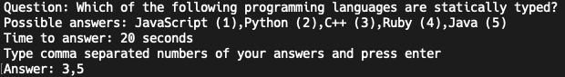
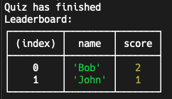

# Realtime Quiz

## Description

There are two folders in this repository: `client` and `server`. The `client` folder contains the Node.js CLI app for the client and the `server` folder contains the Node.js server.

## Running the Application

(was tested on node v18.12.1)

### Client

1. Navigate to the `client` folder.
2. Run `npm install` to install the dependencies.
3. `SERVER_URL="<SERVER_URL>" USER_NAME="<USER_NAME>" node index.js` e.g. 
   `SERVER_URL="http://localhost:8082" USER_NAME="Bob" node index.js`

### Server

1. Navigate to the `server` folder.
2. Run `npm install` to install the dependencies.
3. `ABLY_API_KEY='<ABLY_API_KEY>' node index.js`

### Usage

1. Run the server.
2. Start at least 2 clients to start a quiz. To adjust the number of clients required to start a quiz, change the `REQUISITE_PARTICIPANTS` variable in `index.js` in `server` folder.
3. Type comma separated numbers of your answers and press enter e.g. `1,2,3` and press enter to submit your answer for each client:  
   
4. At the end of quiz clients will exist and leaderboard will be displayed:  
   

### Notes

1. Node's `Worker` is used to run each quiz instance in a separate thread, so the app scales well.
2. Ably channels are used to communicate between the server and the clients, so it's realtime. 🙂 

### Future Improvements

1. Add more unit tests.
2. Better modularity of code.
3. Add proper logging.
4. Dockerize the app.
5. Add linter, consider switching to TypeScript.
6. Consider using web framework such as React for the client.
7. Consider using a database for storing quiz data.
8. Add more features such as configurable quiz question time, configurable number of questions, configurable quizes, better reporting of elapsed time on client, configurable number of participant to start a quiz, etc.
9. Consider showing images in the quiz.
10. Configure CI/CD pipelines.